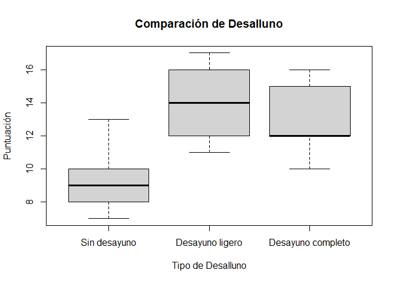

Basic Example
================
Khalil Arab
2025-11-20

# Librerias

``` r
library(dplyr)
```

    ## 
    ## Adjuntando el paquete: 'dplyr'

    ## The following objects are masked from 'package:stats':
    ## 
    ##     filter, lag

    ## The following objects are masked from 'package:base':
    ## 
    ##     intersect, setdiff, setequal, union

``` r
library(ggplot2)
```

``` r
# Crear el data frame
datos <- data.frame(
  Tipo_desayuno = factor(rep(c("Sin desayuno", "Desayuno ligero", "Desayuno completo"), 
                            each = 5),
                        levels = c("Sin desayuno", "Desayuno ligero", "Desayuno completo")),
  Puntuacion = c(8, 7, 9, 13, 10,    # Sin desayuno
                 14, 16, 12, 17, 11, # Desayuno ligero
                 10, 12, 16, 15, 12) # Desayuno completo
)
```

``` r
# Ver las primeras filas del data frame
head(datos)
```

    ##     Tipo_desayuno Puntuacion
    ## 1    Sin desayuno          8
    ## 2    Sin desayuno          7
    ## 3    Sin desayuno          9
    ## 4    Sin desayuno         13
    ## 5    Sin desayuno         10
    ## 6 Desayuno ligero         14

``` r
df <- group_by(datos,Tipo_desayuno)

resumen <- df %>% summarise(     
          Promedio = mean(Puntuacion),
          Desviacion_estandar = sd(Puntuacion),
          n = n()
          )
resumen
```

    ## # A tibble: 3 × 4
    ##   Tipo_desayuno     Promedio Desviacion_estandar     n
    ##   <fct>                <dbl>               <dbl> <int>
    ## 1 Sin desayuno           9.4                2.30     5
    ## 2 Desayuno ligero       14                  2.55     5
    ## 3 Desayuno completo     13                  2.45     5

``` r
# Gráfico de cajas para visualizar las diferencias
boxplot(Puntuacion ~ Tipo_desayuno, data = datos, 
        main = "Comparación de Desalluno",
        xlab = "Tipo de Desalluno", ylab = "Puntuación")
```

<!-- -->

``` r
# Realizar el análisis de varianza (ANOVA)
modelo_anova <- aov(Puntuacion ~ Tipo_desayuno, data = datos)

summary(modelo_anova)
```

    ##               Df Sum Sq Mean Sq F value Pr(>F)  
    ## Tipo_desayuno  2  58.53  29.267   4.933 0.0273 *
    ## Residuals     12  71.20   5.933                 
    ## ---
    ## Signif. codes:  0 '***' 0.001 '**' 0.01 '*' 0.05 '.' 0.1 ' ' 1

``` r
# Opcional: pruebas post-hoc (Tukey HSD) si el ANOVA es significativo
if(summary(modelo_anova)[[1]]$'Pr(>F)'[1] < 0.05) {
  tukey_result <- TukeyHSD(modelo_anova)
  print(tukey_result)
}
```

    ##   Tukey multiple comparisons of means
    ##     95% family-wise confidence level
    ## 
    ## Fit: aov(formula = Puntuacion ~ Tipo_desayuno, data = datos)
    ## 
    ## $Tipo_desayuno
    ##                                   diff        lwr      upr     p adj
    ## Desayuno ligero-Sin desayuno       4.6  0.4899889 8.710011 0.0284289
    ## Desayuno completo-Sin desayuno     3.6 -0.5100111 7.710011 0.0886624
    ## Desayuno completo-Desayuno ligero -1.0 -5.1100111 3.110011 0.7963670

# Usando un ANOVA de una vía y un nivel de significancia de α = 0.05, se obtiene un p-valor \< 0.05, por lo cual rechazamos la hipótesis nula, concluyendo que el tipo de desayuno sí tiene un efecto significativo en el rendimiento de los estudiantes.
