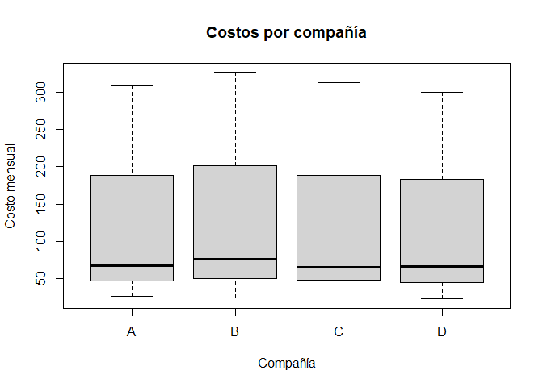
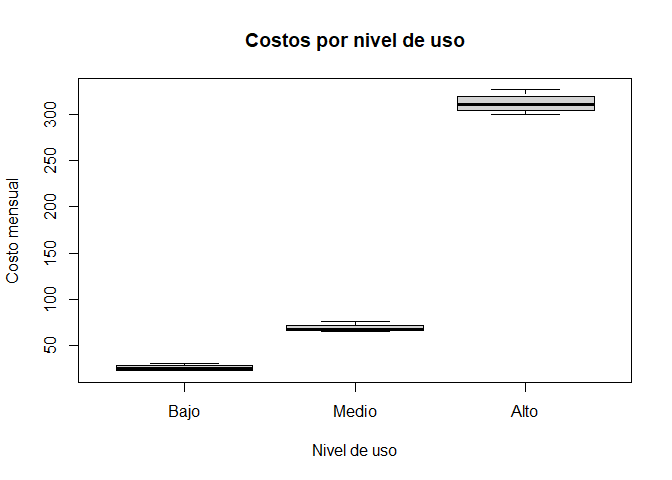

Basic Example
================
Khalil Arab
2025-11-20

# Planteamiento del Problema

La industria de la telefonía celular desea comparar el **costo mensual
promedio** de cuatro compañías (A, B, C y D).  
Se observan tres **niveles de uso** (Bajo, Medio y Alto), que funcionan
como **bloques** en un diseño de bloques completamente aleatorizado
(DBCA).

Objetivo:  
Construir la **tabla de análisis de varianza (ANOVA sin interacciones)**
y determinar, con un nivel de confianza del 95 %, si existen diferencias
significativas entre las compañías.

------------------------------------------------------------------------

# Librerias

``` r
library(dplyr)
```

    ## 
    ## Adjuntando el paquete: 'dplyr'

    ## The following objects are masked from 'package:stats':
    ## 
    ##     filter, lag

    ## The following objects are masked from 'package:base':
    ## 
    ##     intersect, setdiff, setequal, union

``` r
library(ggplot2)
```

``` r
datos <- data.frame(
  Uso = factor(rep(c("Bajo","Medio","Alto"), each = 4),
               levels = c("Bajo","Medio","Alto")),
  Compania = factor(rep(c("A","B","C","D"), times = 3)),
  Costo = c(
    27,24,31,23,
    68,76,65,67,
    308,326,312,300
  )
)
head(datos)
```

    ##     Uso Compania Costo
    ## 1  Bajo        A    27
    ## 2  Bajo        B    24
    ## 3  Bajo        C    31
    ## 4  Bajo        D    23
    ## 5 Medio        A    68
    ## 6 Medio        B    76

``` r
resumen_compania <- datos %>%
  group_by(Compania) %>%
  summarise(
    Promedio = mean(Costo),
    Desviacion_estandar = sd(Costo),
    n = n()
  )
resumen_compania
```

    ## # A tibble: 4 × 4
    ##   Compania Promedio Desviacion_estandar     n
    ##   <fct>       <dbl>               <dbl> <int>
    ## 1 A            134.                152.     3
    ## 2 B            142                 161.     3
    ## 3 C            136                 153.     3
    ## 4 D            130                 149.     3

``` r
resumen_uso <- datos %>%
  group_by(Uso) %>%
  summarise(
    Promedio = mean(Costo),
    Desviacion_estandar = sd(Costo),
    n = n()
  )
resumen_uso
```

    ## # A tibble: 3 × 4
    ##   Uso   Promedio Desviacion_estandar     n
    ##   <fct>    <dbl>               <dbl> <int>
    ## 1 Bajo      26.2                3.59     4
    ## 2 Medio     69                  4.83     4
    ## 3 Alto     312.                10.9      4

``` r
boxplot(Costo ~ Compania, data = datos,
        main = "Costos por compañía",
        xlab = "Compañía", ylab = "Costo mensual")
```

<!-- -->

``` r
boxplot(Costo ~ Uso, data = datos,
        main = "Costos por nivel de uso",
        xlab = "Nivel de uso", ylab = "Costo mensual")
```

<!-- -->

``` r
modelo_anova <- aov(Costo ~ Compania + Uso, data = datos)
summary(modelo_anova)
```

    ##             Df Sum Sq Mean Sq  F value   Pr(>F)    
    ## Compania     3    222      74    1.841     0.24    
    ## Uso          2 189335   94668 2351.990 2.07e-09 ***
    ## Residuals    6    242      40                      
    ## ---
    ## Signif. codes:  0 '***' 0.001 '**' 0.01 '*' 0.05 '.' 0.1 ' ' 1

``` r
anova(modelo_anova)
```

    ## Analysis of Variance Table
    ## 
    ## Response: Costo
    ##           Df Sum Sq Mean Sq   F value    Pr(>F)    
    ## Compania   3    222      74    1.8406    0.2404    
    ## Uso        2 189335   94668 2351.9896 2.067e-09 ***
    ## Residuals  6    242      40                        
    ## ---
    ## Signif. codes:  0 '***' 0.001 '**' 0.01 '*' 0.05 '.' 0.1 ' ' 1

# Conclusión final (α = 0.05)

- El **nivel de uso** (bloques) tiene **p \< 0.05**, por lo que SÍ
  afecta significativamente el costo mensual.
- El factor **compañía** tiene **p \> 0.05**, por lo que NO existen
  diferencias significativas entre compañías.
