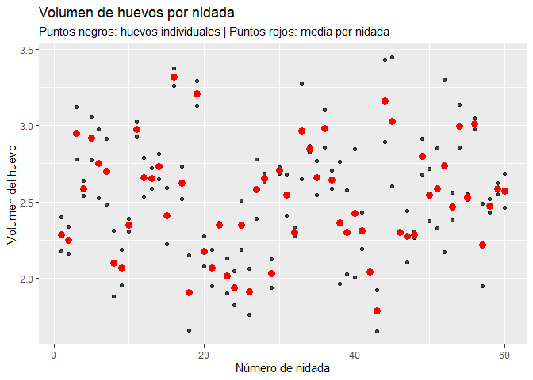

Muestreo por conglomerados de 2 etapas – Volumen de huevos
================
Khalil Arab
2025-11-20

# Librerias

``` r
library(dplyr)
```

    ## 
    ## Adjuntando el paquete: 'dplyr'

    ## The following objects are masked from 'package:stats':
    ## 
    ##     filter, lag

    ## The following objects are masked from 'package:base':
    ## 
    ##     intersect, setdiff, setequal, union

``` r
library(ggplot2)
```

# Crear el data frame

*En esta parte debes reemplazar los datos reales cuando los tengas.  
Por ahora se simulan datos idénticos al diseño del ejercicio: 2 huevos
por nidada.*

``` r
set.seed(123)

# Número de nidadas muestreadas
N <- 60  

# Cada nidada tiene 2 observaciones (2 huevos)
nidada <- rep(1:N, each = 2)

# Promedio poblacional hipotético (en base al gráfico del ejercicio)
media_real <- 2.5

# Variaciones entre y dentro de nidadas
var_entre <- 0.35
var_dentro <- 0.25

efecto_cluster <- rnorm(N, 0, var_entre)

volumen <- media_real +
  rep(efecto_cluster, each = 2) +
  rnorm(2*N, 0, var_dentro)

datos <- data.frame(
  Nidada = nidada,
  Volumen = volumen
)

head(datos)
```

    ##   Nidada  Volumen
    ## 1      1 2.398743
    ## 2      1 2.178253
    ## 3      2 2.336136
    ## 4      2 2.164794
    ## 5      3 2.777600
    ## 6      3 3.121430

# Resumen por nidada

``` r
resumen_nidada <- datos %>%
  group_by(Nidada) %>%
  summarise(
    Media = mean(Volumen),
    De = sd(Volumen)
  )

head(resumen_nidada)
```

    ## # A tibble: 6 × 3
    ##   Nidada Media     De
    ##    <int> <dbl>  <dbl>
    ## 1      1  2.29 0.156 
    ## 2      2  2.25 0.121 
    ## 3      3  2.95 0.243 
    ## 4      4  2.59 0.0699
    ## 5      5  2.92 0.199 
    ## 6      6  2.75 0.321

# Gráfico de puntos y media por nidada (igual al del ejercicio)

``` r
prom_nid <- datos %>%
  group_by(Nidada) %>%
  summarise(Media = mean(Volumen))

ggplot(datos, aes(x = Nidada, y = Volumen)) +
  geom_point(alpha = 0.7, color = "black") +
  geom_point(data = prom_nid,
             aes(x = Nidada, y = Media),
             color = "red", size = 3) +
  labs(
    title = "Volumen de huevos por nidada",
    subtitle = "Puntos negros: huevos individuales | Puntos rojos: media por nidada",
    x = "Número de nidada",
    y = "Volumen del huevo"
  )
```

<!-- -->

# Estimar el promedio poblacional del volumen del huevo

``` r
promedio_est <- mean(datos$Volumen)
promedio_est
```

    ## [1] 2.516758

# Error estándar usando muestreo por conglomerados de dos etapas

``` r
# Número total de nidadas
M <- length(unique(datos$Nidada))

# Tamaño fijo por nidada = 2 huevos
m <- 2

# Medias de cada nidada
medias_clusters <- datos %>% 
  group_by(Nidada) %>% 
  summarise(ybar = mean(Volumen))

# Varianza entre conglomerados
S2b <- var(medias_clusters$ybar)

# Fórmula estándar para μ en muestreo por conglomerados de 2 etapas
# SE(μ̂) = sqrt( S²_between / M )
SE <- sqrt(S2b / M)

SE
```

    ## [1] 0.04575614

# Conclusión del ejercicio

Este estudio representa un **muestreo por conglomerados de dos etapas**
porque:

1.  **Primera etapa:**  
    Se seleccionan **nidadas** (conglomerados).  
2.  **Segunda etapa:**  
    Dentro de cada nidada se miden **dos huevos** (unidades
    secundarias).

Este diseño es apropiado porque los huevos dentro de la misma nidada
suelen ser **más similares entre sí** que con los de otras nidadas.

**Resultados:**

- El **promedio poblacional estimado** del volumen del huevo es:  
  **2.517**

- El **error estándar** del estimador bajo muestreo por conglomerados
  es:  
  **0.0458**

Esto refleja la **variación entre nidadas** y permite obtener un
estimador más realista del error que si se tratara como un muestreo
simple aleatorio.
